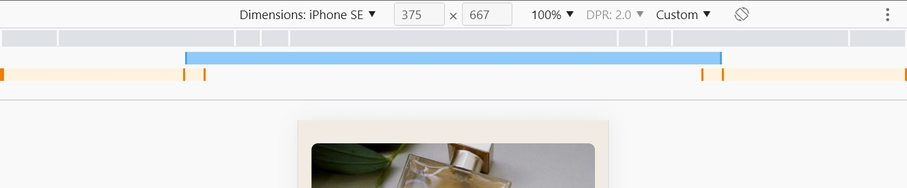
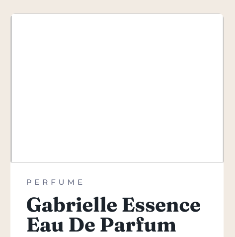

# Frontend Mentor - Product preview card component solution

This is a solution to the [Product preview card component challenge on Frontend Mentor](https://www.frontendmentor.io/challenges/product-preview-card-component-GO7UmttRfa). Frontend Mentor challenges help you improve your coding skills by building realistic projects.

## Table of contents

- [Overview](#overview)
  - [The challenge](#the-challenge)
  - [Screenshot](#screenshot)
  - [Links](#links)
- [My process](#my-process)
  - [Built with](#built-with)
  - [What I learned](#what-i-learned)
    - [Workflow](#workflow)
    - [Structure](#structure)
    - [Responsive Design](#responsive-design)
    - [SEO](#seo)
    - [Accessibility](#accessibility)
    - [Web Optimization](#web-optimization)
    - [The most important learnings of all](#the-most-important-learnings-of-all)
  - [Continued development](#continued-development)
  - [Useful resources](#useful-resources)
- [Author](#author)
- [Acknowledgments](#acknowledgments)

## Overview

### The challenge

Users should be able to:

- View the optimal layout depending on their device's screen size
- See hover and focus states for interactive elements

### Screenshot


### Links

- [Solution URL](https://your-solution-url.com)
- [Live Site URL](https://fm-ayxa-product-preview.netlify.app/)

## My process

### Built with

- HTML5 (Semantic markup, Accessibility guidelines, SEO)
- CSS (Custom properties, Flexbox, CSS Grid)
- Responsive Design (Mobile-first workflow)
- JavaScript (Font loading optimization and error handling)
- [Webpack 5][webpack_5]
- [Sass][sass] (7 in 1 Architecture pattern, Mixins, Partials, Modules, Inheritance)
- [Babel][babel]
- [PostCSS][postcss]

### What I learned

#### Workflow

> “Give me six hours to chop down a tree and I will spend the first four sharpening the axe.”
> —Abraham Lincoln

My experience with this project has convinced me that Licoln was a smart guy, and I'd like to use his approach for my next project, the following way:

###### Prework

1. **Study the design:** examine what you're going to build, and:

   - Identify the page's high level blocks/divisions
   - Decide if you're going to use flexbox or grid for each one

2. **Think ahead about semantics:** classify each block on the page as semantic or auxiliary.

   - **Semantic:** define regions that have a meaningful role in the overall content structure.
   - **Auxiliary:** help build the layout (alignment, position) or store the content that fits no semantic tag.

| Type of block |       Tag       | Common children          |              Common content              |
| :-----------: | :-------------: | :----------------------- | :--------------------------------------: |
|   Semantic    |   `<header>`    | `<h1>`, ``          |            headings and logos            |
|               |     `<nav>`     | `<ul>`,`<li>`            |                                          |
|               |    `<main>`     | `<section>`, `<article>` |                                          |
|               |   `<article>`   | `<h1>` to `<h6>`,        |  blog/forum posts, product cards, etc.   |
|               |                 | `<p>`, `<a>`             |                                          |
|               | `<blockquotes>` |                          |                                          |
|               |   `<footer>`    | `<section>`, `<ul>`,     | sitemap, info about autorship, copyright |
|               |                 | `<a>`, ``           | links to top content, related resources  |
|               |    `<aside>`    | `<p>`, `<a>`             |                side bars                 |
| ------------- |                 |                          |                                          |
|   Auxiliary   |     `<div>`     | ``                  |                                          |
|               |    `<span>`     |                          |        product/role descriptions         |
|               |                 |                          |     button texts, if they have icons     |
|               |  `<ul>`,`<li>`  |                          |     Groups of similar items, such as     |
|               |                 |                          |     comments, reviews, quotes, links     |

3. Choose a responsive design approach: mobile-first or desktop first.

4. Define the stages of development: what are you going to do first and next, what goals you have for each stage and what the end of each stage looks like. This will help you work on a single thing at a time, without derailing to think

   - This is too much and I don't even know where to begin!!!!
   - What will I do when I'm done with this component?
   - I think this is ready, but what if I missing something?
   - Am I ever going to finish this project?
   - I think I could improve that, but do I need to?
     and all that jumping around from one thing to another, just when you thought you were over it.

5. Gather and organize your resources:

   - Text content: get all the text you need in a file, so that you focus on the layout (and not on transcribing) in the development process.
   - Preoptimized images: in the formats and sizes you need.
   - Design system: font families, font sizes, color codes, base units for spacing, etc.
   - Technologies and conventions: identify which ones will be helpful in your project.

6. Prepare your boilerplate: create the minimum set of folders and files you're going to need, organize them, install the necessary packages, set them up and do all you need to get started.

   - _\[Optional] Set up [Webpack][webpack_5]. Webpack is a bundler that helps you handle JavaScript modules, but also ease and speed up your work by automating tasks (compiling and optimizing code, making it compatible with a wide range of browsers, making your resources and text responsive, and so much more!)._
   - _\[Optional] Make sure [Webpack][webpack_5] works correctly with your files. Build at every step of the project, to detect and fix errors efficiently._
     _Take a look at [my step by step guide to set up Webpack 5](./guide_webpack_setup.md), which covers all what I did and worked to set up [Webpack 5][webpack_5] for my project, as well as explanations on what all those settings are about, what you really need to get going and why you need it._

###### (Coding) Work

For a mobile-first approach, I'd:

1. **Do all the HTML markup**, but I'd use `<div>` instead of `` tags in this stage.
2. **Focus on the styles for mobile**, complete one component at a time, and only add background colors to the `div`s that are replacing the images. Use [PerfectPixel][perfect_pixel] to compare your results with the original design.
3. **Forget about mobile and focus on desktop only**. I'd duplicate the styles for mobile design and comment out the copy, modify the styles that aren't commented out, as needed, in order to complete the desktop design.
4. **Use media queries** to introduce the differences between styles at the right screen size.
5. **Style the images:** this will be easier once both layouts are well established. Replace the corresponding `<div>` for `` tags and style them.
6. **Include functionalities using JavaScript**
7. **Extend accessibility and optimization using JavaScript**
8. **Polish the final details of web optimization** with [Webpack][webpack_5], for example.
9. **Document your project**
10. **Deploy your project** using Netlify, for example.

###### Post+Work (More Work)

Whenever possible, take some time to reflect on the main takeaways from your project: the things you learned, the challenges you faced, how you solved them and what you could do better next time. You can make of each project a learning experience, and not only in terms of the technologies you use.

[Let's go back to the table of contents](#table-of-contents)

#### Browsers

In general, I feel comfortable using Firefox for development, but I realized Google Chrome is superior in two stages of the process, namely: responsive design and web optimization.

- **Responsive design:** here's a screenshot of Google Chrome's device toolbar:

  

  What's special about it are those grey, blue and orange bars:

  - **Grey bar:** each division corresponds to a screen-width (mobile, tablet and laptop).
  - **Blue bar:** divisions are determined by your max-width breakpoints.
  - **Orange bar:** divisions are determined by your min-width breakpoints.

- **Web optimization**: Google Chrome has an in-built tool called "Lighthouse" that's perfect to assess the level of optimization of your web page. But it can also give you guides about other aspects like SEO and Accessibility! But that's good enough of an appetizer. All I have to say about it is in [this section](#web-optimization).

#### Structure

This is what I learned in terms of how to organize my code and files, and how to structure my markup and styles:

- **Limit your use of `<div>` and `<span>` tags:** use them as containers for alignment, positioning and styling purposes, and that only when you can't achieve the same result using elements with semantic meaning instead. Also, use `<div>` or `<span>` tags when there isn't an appropriate semantic tag that fits the situation.

- **Use some naming convention for your classes:** I chose BEM (Block\_\_Element--Modifier), which helped me choose meaningful, unique and consistent names for each element more easily, and identify what part of my HTML5 I was affecting with my styles, without having to check my markup every time. Another benefit of this methodology is that it takes the most advantage of Sass features such as nesting.
  Here's the main idea behind:

```html
<!-- Every element has a class name -->
<div class="block1">
  <div class="block1__element-child"></div>
  <div class="block1__element-child--modifier"></div>
  <!-- Standalone elements have their own classes -->
  <button class="block2"></button>
</div>
```

```scss
/* Only nest selectors within their parent declarations */
/* Not within their siblings just because the class name is similar */
.block1__element {
  &__element--child {
  }
  &__element--child--modifier {
  }
}
.block2 {
}
```

- **Organize your partials/CSS modules in some meaningful way:** I decided to follow the [7 in 1 architecture pattern for Sass][7_in_1].

- **Use modules:** in Sass, this is a rather new feature: a partial can't access the code within another unless you explicitly say so. To do that, you have to forward/export all the partials in a folder to an `_index.scss` file in the same folder. Only then you can use/import that code into other partials. And need an `_index.scss` in each folder to forward/export that code to your `main.scss`, the code that is referenced there is what is compiled and stored in your final CSS file.

To illustrate this, suppose we have the following file structure:

```
sass/
|
|– base/
|   |– _mixins.scss
|   |– _index.scss
|
|– pages/
|   |– _home.scss
|   |– _index.scss
|
 – main.scss
```

If you have a mixin in `sass/base/_mixins.scss` that you want to use in `sass/pages/_home.scss`, then this is what your code is going to look like:

```scss
/* sass/base/_mixins.scss */
@mixin some-mixin {
}

/* sass/base/_index.scss */
@forward "_mixins";

/* sass/pages/_home.scss */
@use "_mixins" as m;

.some-class {
  @include m.some-mixin;
}

/* sass/pages/_index.scss */
@forward "_home";

/* sass/main.scss */
@forward "base/";
@forward "pages/";
```

Notice that the `_index.scss` files are only used to forward/export partials.

- **There might be no point in using CSS Grid/Flexbox when the layout has arbitrarily sized gutters**.

---

|                  When using CSS Grid/Flexbox is ideal                  |                  When you can do without CSS Grid/Flexbox                   |
| :--------------------------------------------------------------------: | :-------------------------------------------------------------------------: |
|  |  |

---

- **CSS Grid gives the parent more control than Flexbox over its children's dimensions:** if you have a box and you want to set the sizes (widths/heights) of its children elements, this is what it looks like using:
- Flexbox:

```css
.box {
  display: flex;
}
.child-1 {
  flex-basis: 50%;
  /* styles for child-1 */
}
.child-2 {
  flex-basis: 50%;
  /* styles for child-2 */
}
```

- CSS Grid:

```css
.box {
  display: grid;
  grid-template-columns: repeat(2, 1fr);
}
```

- **CSS filters are the Photoshop for the web... But a primitive Photoshop**: You can use [CSS filters][css_filters] to polish or add effects to images (such as blur, contrast, saturate). Sadly, I haven't found a direct translation from the most common photo editors to CSS filters, so I owe the result of this project to trial and error.
  [Let's go back to the table of contents](#table-of-contents)

##### Responsive Design

The main takeways in this regard are:

- **Use `<picture>` to serve the right image for each screen-size:** this [responsive design technique][picture] uses HTML only. To make this work you need at least a `<source>` and an `` tags, but you can especify mutilple sources as alternatives as well as multiple media queries, file formats and even pixel densities!

```html
<picture aria-hidden="true" id="image-server">
  <source
    srcset="images/image-product-desktop.jpg"
    media="(min-width: 40.625em)" />
  </picture>
```

One important thing I learned about `<picture>` is that it is an inline element, whose original purpose in life is switching images for responsive design, so if you want to style your images, use your CSS on the `` tag instead. Any alt text, classes and styles you applying to it, will be adopted by the other images in your source in case they're used instead.

Think of it this way: `<source/>` simply provides a list of values for the `src` attribute of the image tag, but all the information about whatever image is loaded is in your `` tag.

- **Mixins and maps are the future of breakpoints**: this is specific to Sass. Use a Sass map to associate a name to your breakpoints. This way, you can modify them in one file and access them in any other file, using mixins. Like so:

```scss
/* _mixins.scss */
$breakpoints: (
  "large": "40.625em",
  "xlarge": "112.5em",
);

@mixin breakpoint($size) {
  @media (min-width: map-get($breakpoints, $size)) {
    @content;
  }
}

/* _card.scss */
@use "../abstracts/mixins" as m;

&__image {
    /* some styles */
    @include m.breakpoint(large) {
      /* styles here apply when min-width=40.625em */
    }
```

[Let's go back to the table of contents](#table-of-contents)

##### SEO

Some good practices for SEO are:

- **Google doesn't know what your page is about... Unless you say it**: add information about your web page in the `<head>`, at the very least, a title and a description, and make sure to also include relevant keywords in your writing. These are the data search engines display in its search results, and they're what help users find your web page.

For illustrative purposes, this code:

```html
<title>Frontend Mentor | Product preview card component</title>
<meta
  name="description"
  content="This is Ayxa Chaverra's solution to one of the Frontend Mentor challenges, implementing accessibility, responsive design and SEO best practices. Check it out!"
/>
```

Yields this result:

You can see a preview for your own web page using [this SERP snippet optimizer][serp_snippet].

- **Your good practices pay off**: using proper semantic markup to structure the page helps search engines make sense of what the page is about, and just like optimizing the code, taking care of responsive design or fulfilling the required accessibility standards, that's acknowledged and rewarded with a higher rank in the search results.

- **Add meaningful alt text to relevant images** This part was especially challenging in this project, since the image of the product is one we would like to be accessible to search engines, so it's relevant from a SEO standpoint; however, it's not as relevant from the accessibility standpoint, as it could be considered as a decorative image...

[Let's go back to the table of contents](#table-of-contents)

##### Accessibility

- **Put yourself in your users' shoes... Or use their devices**: when you build websites, keep in mind that your users may be using different devices than those you used for development, and I'm not only talking about using a phone or a tablet instead of a computer. Some users use their keyboards to navigate the web, some use assistive devices because they've got some level of visual disability, they deserve to have a nice experience using your web page just as much as anyone. Take some time to learn how they access and navigate your web page, use their devices and try to make sure your page is accessible to everyone.

If you develop on Windows, I recommend you use [NVDA][nvda] to have an idea of what the experience of accessing and using your page is like for people with visual disabilities. [NVDA][nvda] is a screen-reader, for Windows at least, that you can download for free (although you should consider donating, if you can).

I used [NVDA][nvda] to hear what information was going to be delivered to non-sighted users, to make the necessary adjustments so that their experience were as close as possible to that of sighted users. If you use Mac, I know it has an in-built screen reader you can use as an alternative.

- **Choose an appropiate alt text, which could be none** Going back to the discussion of whether the image of the product should have an alt text or not, from a SEO standpoint, I'd say yes. But, from an accessibility standpoint, the answer isn't as straightforward. If you inspect the code of a product card in an online store, you'll surely find one of these two approaches:

  - \[Approach 1]: The alt text is a duplicate of the name of the product.
  - \[Approach 2]: The alt text is left blank.

The problem with \[Approach 1] is that, unless the product has customizable features (i.e. it comes in different colors or fragances, or offers the possibility of adding accessories), the user usually hears the same information twice, the more images in the page, the more annoying the experience.

With \[Approach 2], the assistive device skips this element, since it understands the content of the image doesn't add up anything relevant to the already existing information in the page (because it'd be redundant to the surrounding text, or because the image is merely decorative, for example).

So, in \[Approach 2], the user doesn't hear duplicate information, but then this image doesn't improve SEO and what might be even worse, if the link to the image is broken or the resource can't be loaded, people might not know what the image was about.

I solved this issue by providing a descriptive alt text for search engines, but I hid it from assistive devices using `aria-hidden = true`. This way, search engines will have an idea of what the image is about, but non-sighted users won't have to bear hearing the same thing twice.

```html
<picture aria-hidden="true" id="image-server">
  <source
    srcset="images/image-product-desktop.jpg"
    media="(min-width: 40.625em)"
  />
  
</picture>
```

Leaving it as it is, yields yet another problem. If none of the images can't be loaded, the alt text takes its place, what means sighted users can read a description of the image, but non-sighted users can't, and not only that! People with a partially impaired vision will be able to see there's text there, but they won't know what it says, because the alt text is inaccessible to their assistive devices! WHAT. A. MESS.

Fortunately, there's an easy fix for this:

Create a pseudo-element for the image, and use it as a warning for the user in case the image is missing. And don't worry, it won't eclipse the actual image, in case it loads, because pseudo-elements of image elements are only visible when the images can't be found.

```css
.card__image::after {
      content: "Sorry, we couldn't find the image of the product 😥";
      display: flex;
      align-items: center;
      text-align: center;
      padding: var(--default-font-size);
      width: 100%;
      height: 100%;
      position: absolute;
      top: 0;
      background-color: var(--color-primary-light);
      color: var(--color-white);
    }
  }
```

Only one more detail needs to be taken care of. Since the alt text is still there, the assistive device will read that and not the text in the pseudo-element. That means they'll provide a different information than what's accessible to sighted-users. Notice that the content in the pseudo-element isn't accessible to the assistive devices. Here, JavaScript comes to our rescue:

```javascript
const image = document.querySelector(".card__image");
const imageServer = document.querySelector("#image-server");

image.addEventListener("error", function () {
  if (!imageServer.ariaHidden) return;
  this.onerror = null;
  this.alt = "Sorry, we couldn't find the image of the product 😥";
  imageServer.ariaHidden = false;
});
```

And that's it.

Now, in case you're thinking about leaving the alt text blank, using JavaScript, I must warn you that I noticed something really weird when one does that, at least in Firefox:



The fix I found was making `alt=" "`, at least.

- **Make prices accessible:** I encourage you to listen to the prices section using NDVA, but if you can't simply close your eyes and imagine you want to know how much the perfum is and you hear "149.99 dollars, 169.99 dollars", and then, you wonder if there is a bug with your screen reader, maybe it skipped to another perfum? Maybe you accidentally added another article and the price increased? Is it a discount?

The pricing information isn't clear for people who can't see the linethrough style. You can use [`<s>` tags][s_tag] in these cases, but it's not enough.

To solve this issue, you can hide this section from assistive devices

```html
<p class="card__info-prices" aria-hidden="true">
  <span class="card__info-price--new"><strong>$149.99</strong></span>
  <s class="card__info-price--old">$169.99</s>
</p>
```

And create a section for them, that's hidden from sighted users, but delivers the same information:

```html
<span class="visually-hidden">For $149.99 instead of $169.99</span>
```

Where:

```css
.visually-hidden {
  position: absolute !important;
  width: 1px !important;
  height: 1px !important;
  padding: 0 !important;
  margin: -1px !important;
  overflow: hidden !important;
  clip: rect(0, 0, 0, 0) !important;
  white-space: nowrap !important;
  border: 0 !important;
}
```

- **Style focus states differently from hover states:** I know you may be tempted to always do this:

```css
.button:hover,
.button:focus {
  /* some style */
}
```

And call it a day, but wait a second! Remember I told you some people can only use their keyboards to navigate through the web? Well, that's also how they interact buttons and links, and without a cursor, they may not predict what element in the whole page will focus next and they depend on visual changes and transitions to know which part of the page they're currently interacting with.

If those changes are too subtle, like a subtle change in the background color, they might not notice it. Now,if you're not a designer (just like me), you can follow [this guidelines][accessible_focus] from a digital product agency, with professional designers, and do something like this:

```css
.button:hover,
.button:active {
  background-color: var(--color-primary-dark);
  cursor: pointer;
}
.button:focus {
  outline: 2px solid var(--color-primary-light);
  outline-offset: 3px;
  background-color: var(--color-primary-dark);
}
```

See the difference for yourself:

---

|                      .button:hover                      |                      .button:focus                      |
| :-----------------------------------------------------: | :-----------------------------------------------------: |
|  |  |

---

[Let's go back to the table of contents](#table-of-contents)

#### Web Optimization

Once you have a fully working web page, the next goal is to have a **performant web page**, and [Webpack][webpack_5] and Lighthouse will be your best allies in the process.

If you've never heard of Lighthouse, it's an in-built tool in Google Chrome. You can find it among the developer's tools (press F12, or right click on any web page in the browser, and then left click on "Inspect"), and then click on the button with this icon: ">>". A dropdown menu will show up, and "Lighthouse" will be among the options. Click on it, like so:


And you'll see the following tab:


Lighthouse can assess the performance of your web page on mobile or desktop devices, in the listed categories, and generate a report to tell you what you're doing well and what you could do better. Once you've set your preferences, all you have to do is click on "Generate report".

In case you have Chrome extensions installed, they might affect the performance of your web page and hinder Lighthouse's job, so you should run the tool on an incognito window, to make sure the results represent reality as closely as possible.
That said, the main takeaways from this stage were:

- **Use as few custom fonts as possible and self host as many of them that you can**: I bet you also love how easy it is to load fonts from Google Fonts, so you might be as surprised as I was to discover that was the main hard blow to my page's performance. Why? Because the browser would wait until the fonts were downloaded before painting anything on the screen, the longer it took to complete the download, the longer you would have to stare on a blank page.

If you don't use custom fonts, then that waiting time is reduced significantly. So, if performance is important to you, try not to use web fonts at all. But I know that's too restrictive in most of cases.

What's important is that you're aware that the more resources your users need to download, the longer they'll have to wait to get the full experience your web page has to offer, and that's going to affect the performance. So try not to use more than 2 completely different web fonts, as it is the case of this project.

And if you are going to use web fonts but you care about performance, lose no hope, there are other, more performant ways to load your fonts. I'll explain the basics of the one that I used, which is a FOUT with preload, but I encourage you to learn more about [other techniques here][font_loading_strategies] or in any of the multiple articles Zach Leatherman, and other authors from CSS Tricks, have written on the topic.

Basically, you download and self host the fonts you need, use preload to tell the browser to give them priority in its requests, but to use some other font to paint the page, in the meantime. Once the download is complete, the browser swaps the fonts, which is perceived by the user as a Flash Of Unstyled Text (FOUT), hence the name. You can observe this process in more detail using Google Chrome developer tools.

Once you generate a report using Lighthouse, scroll down until you see the button "View Original Trace" and click on it:


That will lead you to the Performance tab, where you can see a sequence of screenshots that simulate how your page loads, millisecond by millisecond, if you hover over the trace like so:


So, **here's how to actually do it:**
First, download the font files you need. I recommend you not to do it from Google Fonts, since (at least as of September of 2022) they come in the .tff format, which isn't optimized for the web, due to its size. Instead, I encourage you to use the [Google Webfonts Helper][fonts_helper], which is what I used.

The files you download from the [Google Webfonts Helper][fonts_helper] are already optimized for the web, since they're .woff and .woff2 files, and those formats are lighter to download. And the benefits don't stop there, because this tool also provides you with the necessary CSS code to load your fonts, ready to copy and paste.

Simply add this style `font-display: swap;` at the end of each `@font-face` block declaration. You can see an example [here](./src/sass/base/_typography.scss) This is what allows the browser to switch fonts when the download is ready and if you look carefully, you'll also find it in the snippets you copy and paste from Google Fonts :D

Now, there's a problem with this property: it is not supported in all browsers (among which, we have I.E., what a surprise!). So, if your target audience doesn't use I.E., you're good to go with CSS only. Otherwise, you'll like to use JavaScript to force the swap. You can find an example [here](./src/js/font_handler.js).

- **Minify your code:** it turns out that comments, blank spaces and line breaks increase the size of your files, so if you get rid of all that, your users will get the resources faster and that's good for performance. You can minify your HTML, CSS, JS files (you can even compress your fonts, images and videos, but those compressions are different). There are tools to do each, but Webpack 5 does that for you, automatically (once you set it up for production).

- **Make your code backwards compatible:** remember not everyone is a web developer and tries to keep up to date with the latest browser updates: before I knew anything about web development, I was always annoyed by how often I needed to update my browsers: "What are all these updates for???"

Maybe that new feature you're so excited to use in your project isn't supported in all browsers yet, and there are even some people out there for whom updating their browsers might not even be a possibility (their computers are too old, who knows?).

Therefore, if your target audience includes those people, try to make your code compatible with those browsers. It's not that hard, I promise. For CSS, you can use the autoprefixer plugin of PostCSS and for JavaScript, you can use Babel. Once again, Webpack does all of it automatically for you, once you've set it up.

I encourage you to check [my guide to set up Webpack 5](./guide_webpack_setup.md) where I added explanations on what does what, what you really need and why you need it, as well as some additional resources to dive deeper on the topic.

[Let's go back to the table of contents](#table-of-contents)

#### The most important learnings of all

Even though this was a simple component, this was a long journey for me. When I started, I didn't have a workflow defined, nor did I know anything about Sass, Webpack, Font loading strategies, Lighthouse, Markdown... And I know I didn't need to use all of that, but I decided to use this project as a learning experience.

Leaving the complexity to the concepts and technologies and not on the design surely made it more manageable for me. I think I learned a lot from this project, and I learned as much as I wanted, I got as far as I allowed myself to and here are the main takeaways from my journey, which might not be related to coding at all:

- **Plan ahead**, it seems like that's too much time not working, and it's true, because it makes coding easier and saves you tons of time and headaches.

- **Commit, commit, commit**, not only it is a good practice but also a life saver when something goes wrong.

- **Document as you go**, documenting is a boring task for us who prefer the excitement of coding and learning, but it's important and has to be done. So, taking notes of the important stuff as you go and then connecting those notes will be easier than trying to remember everything at the end, to pull off the whole README from scratch. Bookmark relevant links, too.

- **Measure your progress:** because only that way you can have an objective perspective of your work and your skills. Projects are tied to deadlines, and knowing how fast you can achieve some goals is key, because only then you know what's feasable for you and what expectations are realistic. Knowing your level of proficiency will help you know when to ask for help and how much you're improving in your journey.

- **Some things will take some time**. Sometimes you just want to finish a task, but you're stuck and you spend a lot of time debugging and it doesn't work, and minutes become hours, and it just doesn't work, and you're even thinking of staying up all night, because it's just this one little tiny thing that's missing. Don't.

I've learned some things take some time, time to clear your head, so that you can finally see the bug that's in front of you, time to wrap your head around a new concept, time to get help, time to come up with an idea... You have to do your best. But you must know that banging your head against the keyboard for hours and staying all night while you stare at StackOverflow isn't doing your best.

Sometimes, the best you can do is to step back from what you're doing, remember you're human and be gentle with yourself.

**Doing your best means making the best possible use of your time**, within your realm of possibilities, so you must know what's possible for you at the moment and among those things, choose what you can do best.

If this task isn't working right now, go do something that does: maybe that's working on something else until you get some help, or maybe that's just taking notes of the resources you can consult later (when your mind is clearer), shutting down your computer, taking care of your mind and body, and trying again tomorrow.

Because some things take some time, you shouldn't give up, but instead have faith in yourself and the process, and keep showing up, every new day, keep trying and doing your best, because only that way you'll accomplish your goals. I know you will, and I hope so do you.

### Continued development

- One of the most challenging tasks I had to face was setting up Webpack 5 for my project. Although I'm satisfied with the results, I'd like to learn about more advanced settings that allow me manage without an HTML template, seize cache storage and plugins for responsive design.

- I struggled to keep the attribution section in the page while making the rest of the layout match the original design, in terms of alignment and positioning. That led to tricky media queries and styles, so I'd like to find a simpler, cleaner and more straigtforward way to accomplish the same.

- I used this project to experiment, so I could go a bit back and forth between the development stages. I'd like to be more organized next time and follow some already existing commit convention to get a more organized workflow.

### Useful resources

Here's a list of the reources that I mentioned in this README:

- Technologies:

  - [Webpack][webpack_5]
  - [Sass][sass]
  - [Babel][babel]
  - [PostCSS][postcss]

- Tools

  - [NVDA][nvda]
  - [Perfect Pixel][perfect_pixel]
  - [SERP Snippet Optimizer][serp_snippet]
  - [Google Webfonts Helper][fonts_helper]

- Articles

  - [SASS 7 in 1 Architecture Pattern by Kiran Workspace][7_in_1]
  - [CSS filters by MDN][css_filters]
  - [Picture tag by MDN][picture]
  - [s tag by MDN][s_tag]
  - [Designing for Accessibility: Focus States by DockYard][accessible_focus]
  - [Developing a Robust Font Loading Strategy for CSS-Tricks by Zach Leatherman][font_loading_strategies]

- And some tutorials I recommend:

  - ["Stop using @import with Sass | @use and @forward explained"](https://youtu.be/CR-a8upNjJ0) by Kevin Powell, that helped me understand Sass modules better.
  - [Figma File to Code. The Designer to Developer Handoff w/ Frontend Mentor Founder [HTML+CSS Tutorial]](https://youtu.be/PY_iIeAKFw0). This is the first part of one of Zero to Mastery workshops, by the founder of Frontend Mentor, Matt Studdert, himself. It helped me organize my workflow better.
  - [How to Make a Landing Page using HTML, SCSS, and JavaScript - Full Course](https://youtu.be/aoQ6S1a32j8), one of FreeCodeCamp turorials, explained by Jessica Chan (Coder Coder). This helped me seize Sass mixins and maps to handle my breakpoints.
  - And, of course, my own [guide to set up Webpack 5 for your (HTML, Sass/CSS and JavaScript) project](./guide_webpack_setup.md), where I gather and summarize all I learned about setting up Webpack 5.

## Author

- Github - [@achaverrar](https://github.com/achaverrar)
- Frontend Mentor - [@achaverrar](https://www.frontendmentor.io/profile/achaverrar)

## Acknowledgments

I'm very grateful with [Matt Pegg](https://www.youtube.com/channel/UCfLsWcGtbMntd4z1DmzCmlg/featured) for answering my questions about how to takle the development process and introducing me to Lighthouse.

I'd also like to thank my mom and my friends: Alex, Juan Manuel and Tania, who were with me at every step of the process, encouraging and comforting me, having faith in me. You didn't help me debug my code, but I wouldn't have been able to make it without you, you taught me the most important learnings of all.

[webpack_5]: https://webpack.js.org
[sass]: https://sass-lang.com
[babel]: https://babeljs.io/
[postcss]: https://postcss.org/
[nvda]: https://www.nvaccess.org/download/
[perfect_pixel]: https://chrome.google.com/webstore/detail/perfectpixel-by-welldonec/dkaagdgjmgdmbnecmcefdhjekcoceebi
[serp_snippet]: https://www.highervisibility.com/seo/tools/serp-snippet-optimizer/
[fonts_helper]: http://google-webfonts-helper.herokuapp.com/fonts
[7_in_1]: https://kiranworkspace.com/sass-architecture/
[css_filters]: https://developer.mozilla.org/en-US/docs/Web/CSS/filter
[picture]: https://developer.mozilla.org/en-US/docs/Web/HTML/Element/picture
[s_tag]: https://developer.mozilla.org/en-US/docs/Web/HTML/Element/s
[accessible_focus]: https://dockyard.com/blog/2020/04/28/designing-for-accessibility-focus-states
[font_loading_strategies]: https://www.zachleat.com/web/css-tricks-web-fonts/
