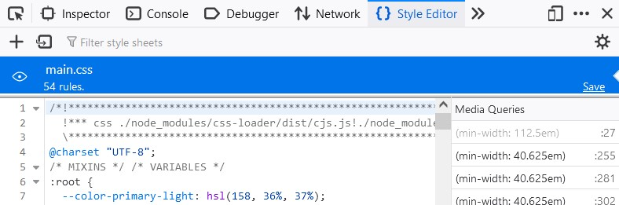
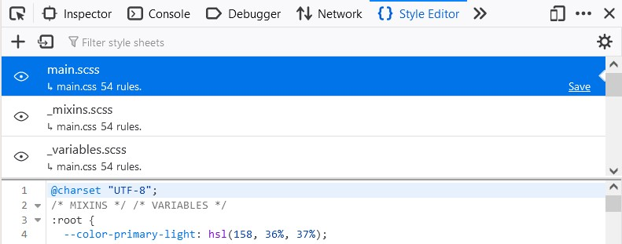
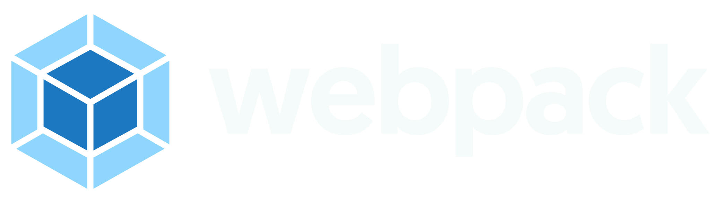
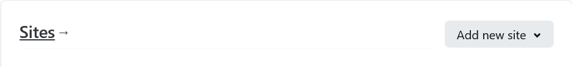
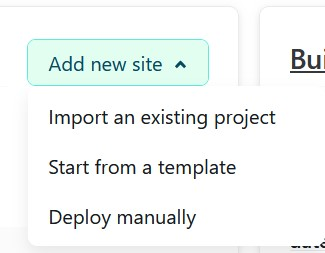

# Guide to set up Webpack 5 for your (HTML, Sass/CSS and JavaScript) project

This a guide on how to set up Webpack 5, based on what I learned through tons of research and trial and error, and finally worked on my project, in 2022. I found many outdated resources, even about Webpack 5, and some that just didn't work or were mostly focused on React.js. So, hopefully this will help someone else.

Every read, comment, question, correction and suggestion is highly appreciated. Thank you,

[Ayxa Chaverra R.](https://github.com/achaverrar)

_\[**Note 1**] As of September of 2022, I've never used JavaScript frameworks, so that's not included in this guide. This might change in the near future._
_\[**Note 2**] I'll use Visual Studio Code editor as well as NPM for this guide._

---

## Table of contents

- [Basic Setup](#basic-setup)
- [Additional settings](#additional-settings)
  - [Add a Live Server](#add-a-live-server)
  - [Integrate external resources](#integrate-external-resources)
    - [/(Java)?(Scripts\*)+/gi](#javascriptsgi)
      - [Multiple modules into 1 bundle](#multiple-modules-into-1-bundle)
      - [Multiple modules into multiple bundles](#multiple-modules-into-multiple-bundles)
    - [Stylesheets](#stylesheets)
      - [CSS](#css)
      - [Note on Source Maps](#note-on-source-maps)
      - [Sass and other CSS frameworks](#sass-and-other-css-frameworks)
    - [Multimedia resources (images, videos, SVGs, etc.)](#multimedia-resources-images-videos-svgs-etc)
      - [Multimedia resources from your HTML template](#multimedia-resources-from-your-html-template)
      - [Multimedia resources from JavaScript and/or Sass/CSS](#multimedia-resources-from-javascript-andor-sasscss)
    - [Fonts](#fonts)
  - [Web Optimizetion](#web-optimizetion)
    - [Use different settings for development and production](#use-different-settings-for-development-and-production)
    - [Minify your code (and handle source-maps)](#minify-your-code-and-handle-source-maps)
    - [Transpile Your JavaScript (Make It Old-Browsers-Friendly)](#transpile-your-javascript-make-it-old-browsers-friendly)
    - [Autoprefix Your CSS (Make it All/Most-Browsers-Friendly)](#autoprefix-your-css-make-it-allmost-browsers-friendly)
  - [Deploy your code (using Netlify)](#deploy-your-code-using-netlify)
- [Useful Resources](#useful-resources)

---

## Basic Setup

1.  Create a new folder for your project, let's say `webpack-setup`
2.  Open the folder using VS Code
3.  Open the terminal ( \[ Ctrl ] + \[ Shift ] + [ \` ] )
4.  Type and enter: `npm init -y` in the terminal to create a `package.json` (and a `package-lock.json`) file in your folder with the basic default settings needed to run your project.
    - _\[Note]: if you don't use the flag `-y` in the command, you'll have to fill in the settings yourself. No matter if you use the flag or not, you can always modify the settings from the `package.json` file itself._
5.  Open `package.json` and replace the line `"main": "index.js",` with `"private": true,` to prevent your project is accidentally published as an npm package.
6.  Type and enter: `npm i -D webpack webpack-cli` to install Webpack locally in your project, as a development dependency.

    - _\[Note 1]: if you don't use the flag `-g`, which stands for globally, you're installing the package "locally". In other words, installation is valid and available for this project, but doesn't count for any other project._
    - _\[Note 2]: `i` is a shortcut for `install`. So this command is equivalent to `npm install -D webpack webpack-cli`._
    - _\[Note 3]: The flag `-D` is equivalent to `--save-dev`, so `npm i -D your-package` does the same as `npm i --save-dev your-package`. This flag tells npm to install the package as a development dependency, which means that you, and any other developer or deployment service will need the forementioned package to modify your code and produce the final files for production, but they won't need the package to run your code, once those files are generated._
    - _\[Note 4]: don't worry if you install the same package twice, it has no effect._
    - _\[Note 5]: if you ever install a package as a wrong kind of dependency you can run `npm uninstall your-package-name`. An alternative solution would be to look for the package name in your `package.json` file, within `"devDependencies": {}`, remove that line, then delete the folder `node_modules` and run `npm install` in the terminal, to reinstall all the packages listed in your `package.json`._

    _**\[Optional Checkpoint]:** you can verify Webpack was installed correctly by checking your `package.json` file, and looking for `"webpack"` and `"webpack-cli"` in the list of `"devDependencies"`._

7.  Create a folder in `webpack-setup` to store the files you'll use in development. You can name your folder as you like, but Webpack will recognize `src` automatically, by default. I'll use this folder organization for this guide:

    ```
    Webpack_Setup/
    |
    |– src/
    |   |– fonts/
    |   |– images/
    |   |– js/
    |   |– sass/
    |   |– template.html
    |   |– index.js     <--- This is a MUST
    |
    |-package-lock.json
    |-package.json
    |
    ```

    - _\[Note 1]: You don't have to create the exact same file structure, but you **MUST** create a JavaScript file within your `src` folder, because Webpack will use it as an entry point for the rest of files that go in the bundle. The default name Webpack recognizes is `index.js`._
    - _\[Note 2]: We're storing our code for development in a folder, because Webpack will create another folder to store the files for distribution. This will help us be more organized._ -_\[Note 3]: To avoid errors in this stage, use a template without references to external resources or comment out those references in your template, so that we can integrate them gradually later._

8.  Create a JavaScript file for your Webpack settings in the root of your project folder. The default name Webpack will recognize is `webpack.config.js`.
    So far, your folder should look like this:

    ```
    Webpack_Setup/
    |
    |– src/
    |   |– fonts/
    |   |– images/
    |   |– scripts/
    |   |– styles/
    |   |– template.html
    |   |– index.js
    |
    |-package-lock.json
    |-package.json
    |- webpack.config.js  <-- This is new
    |
    ```

9.  Open `webpack.config.js` and add the following lines:

    ```javascript
    const path = require("path");
    /* This will use one of Node modules to find the absolute path to a spacified folder or file. */
    module.exports = {
      mode: "development",
      /* Unlike in "production" mode, Webpack won't minify your code or invest too much time 
      optimizing it, so building will be faster. */
      entry: {
        main: "./src/index.js",
        /* This is the relative path to your entry point, you can use other name instead of "main", 
        this is simply an identifier, when you add more than 1 entry point. */
      },
      output: {
        filename: "scripts/[name].js",
        /* This is the subfolder in the distribution folder, where the bundle of JavaScript modules 
        will be stored. If you used [name].js, [name] will be replaced by the identifier you used in 
        module.exports.entry */
        path: path.resolve(__dirname, "dist"),
        /* This is the absolute path to the distribution folder. It'll be a subfolder of 
        `Webpack_Setup` and its name will be "dist" or whatever you state there. */
        clean: true,
        /* If set to true, files from old building processes will be cleaned every time 
        a bundle is generated */
      },
    };
    ```

10. Add these lines to your `"scripts"` in `package.json`:

    ```json
    "scripts" : {
      "build": "webpack", // Will create a dist folder with the files produced in the building process
      "watch": "webpack --watch", // Will be watching your files and trigger the build process every time it detects a change
    }
    ```

    - _\[Note]: "build" and "watch" are names you give to a series of instructions for NPM to run. If you run the command `npm run watch`, you're telling NPM to run the commands under the name "watch", so it'll run `npx webpack --watch` in your terminal._

    **\[Optional Checkpoint]:** to verify you're on the right track, run the script "build". You should see a new folder named `dist` in your root, like this:

    ```
    Webpack_Setup/
    |
    |- dist/
    |   |- scripts/
    |         |- main.js    <--- This is new
    |
    |– src/
    |   |– fonts/
    |   |– images/
    |   |– scripts/
    |   |– styles/
    |   |– template.html
    |   |– index.js
    |
    |-package-lock.json
    |-package.json
    |- webpack.config.js
    |
    ```

    If you take a look at `main.js` you should see it isn't empty, but the opposite! It has some weird comments and code, but you don't have to worry about it.

11. Back to the console, run this command `npm i -D html-webpack-plugin`. The HTML Webpack plugin will help you handle HTML templates, automatically include lines of HTML to it, and store generated HTML files in the `dist` folder. But to use Webpack plugins, you first need to set them up in your settings file.

    - _\[Note]: Webpack uses loaders and plugins. Loaders help recognize and import files in determined formats, whereas plugins help do all sort of tasks with or within these files._

12. Open `webpack.config.js` and add these lines this line: `const HtmlWebpackPlugin = require("html-webpack-plugin");` before `module.exports` and the following lines, at the end of it (or right after the `output` object within `module.exports`). Like so:

    ```javascript
    /* webpack.config.js */
    const path = require("path");
    const HtmlWebpackPlugin = require("html-webpack-plugin");

    module.exports = {
      /* Here go mode, entry, output */
      plugins: [
        new HtmlWebpackPlugin({
          template: "./src/template.html",
          /* This will use your html file as a template */
          filename: "./index.html",
          /* This is the name (and path) Webpack will use to store the generated file */
        }),
      ],
    };
    ```

    **\[Optional Checkpoint]:** if you don't have any code in your template.html, open it and type \[ ! ] + \[ Tab ] to generate some HTML boilerplate.

    Then, run the build command in your terminal again, and check your `dist` folder. You should see a new file called `index.html` like this:

    ```
    dist/
    |   |- scripts/
    |         |- main.js
    |
    |-  index.html      <--- This is new
    ```

    And if you open the new file, you should see a `<script>` tag by the end of the `<head>` referencing your bundle like this:

    ```html
    <!-- index.html -->
    <!-- HTML code from your template -->
    <head>
      <!-- More HTML code from your template -->
      <script defer src="scripts/main.js"></script>
    </head>
    <!-- Even more HTML code from your template -->
    ```

    **\[Optional Checkpoint]:** run the `watch` script in your terminal and then open your `index.js` file. Add the following line to it:

    ```javascript
    /* index.js */
    console.log("The watch script is working, yaaaaay!!");
    ```

    Save the file, and then open the `index.html` file in your favorite browser. You should see a message in the console of the developer tools (press \[ F12 ] or right click on the page, and then left click on "Inspect"). To stop watching type \[ Ctrl ] + \[ C ] in the terminal, and then enter `y` (for Yes).

13. Congratulations, you've just finished the basic set up. From now on, the rest of instructions depend on the specific needs of your project, so feel free to skip the tasks that don't apply in your case.

[Go back to the Table of contents 🔝](#table-of-contents)

## Additional settings

I added some optional checkpoints here, but when I don't, you're still encouraged to check your progress (at least) at the end of the section to make sure you're still on the right track.

### Add a Live Server

1. Run `npm i -D webpack-dev-server` to install Webpack live server.
2. Add this script to your `package.json`:

   ```json
   "scripts": {
     "serve": "webpack-dev-server --open"
   }
   ```

   **\[Optional Checkpoint]:** run the "serve" script in your terminal. Your default browser should open a tab with your project automatically. Check it is running on a local host and that the message you set up before is showing in the console.

[Go back to the Table of contents 🔝](#table-of-contents)

### Integrate external resources

#### /(Java)?(Scripts\*)+/gi

##### Multiple modules into 1 bundle

You can combine multiple JavaScript files into 1 entry point by simply importing them into the entry point. Let's say you have the following file structure:

```
  src/
  |   |- scripts/
  |         |- script1.js
  |         |- script2.js
  |- index.js
```

Then you can create a single JavaScript script for production, by simply adding this code to your `index.js` file:

```javascript
/* index.js */
import "./scripts/script1";
import "./scripts/script2";
```

This way, if you run the build command, you'll end up with a single JavaScript file (namely `main.js`) in your distribution folder, which contains the code from all `script1.js`, `script2.js` and `index.js`.

[Go back to the Table of contents 🔝](#table-of-contents)

##### Multiple modules into multiple bundles

You can achieve this by creating more than 1 entry point. Let's say you have the following file structure:

```
  src/
  |   |- scripts/
  |         |- script1.js
  |         |- script2.js
  |         |- script3.js
  |- index1.js
  |- index2.js
```

And you want to create two bundles: one contains the code from `script1.js`, `script2.js` and `index1.js`, and the other contains the code from `script3.js` and `index2.js`. Then, you should use `index1.js` and `index2.js` as the entry points, and import the corresponding modules into each of them. This way:

```javascript
/* index1.js */
import "./scripts/script1";
import "./scripts/script2";
/* index2.js */
import "./scripts/script3";
```

Then, you have to tell Webpack you're using those two entry points. To do that, open your `webpack.config.js` and modify the `module.exports.entry` object:

```javascript
/* webpack.config.js */
module.exports = {
  /* mode */
  entry: {
    module1: "./src/index.js", // You can change module1 for whatever name you want
    module2: "./src/index2.js", // You can change module2 for whatever name you want
  },
  /* output, module, plugins, devtool */
};
```

If you run the build script in your terminal, you'll see the two bundles as `module1.js` and `module2.js` in your distribution folder, with the expected code. As well as their respective script tags in `index.html`.

[Go back to the Table of contents 🔝](#table-of-contents)

#### Stylesheets

Just like with multimedia resources, all hardcoded code in your template needs no further settings. But when it comes to stylesheets and scripts, I encourage you to use Webpack to incorporate them into your project, so that you can seize all the bundler can do for you.

To achieve this, you'll need some loaders (and a plugin):

##### CSS

1. Run `npm i -D mini-css-extract-plugin css-loader`
2. Add these lines to your settings file:

```javascript
/* webpack.config.js */
const MiniCssExtractPlugin = require("mini-css-extract-plugin");
module.exports = {
  /* mode, entry, output */
  module: {
    rules: [
      /* Each object in this array contains the rules of how to
      handle a especific type of file */
      {
        test: /\.css$/i,
        /* These regexp tell Webpack what file format corresponds
        to this rule */
        use: [
          // THE LOADERS MUST GO IN THIS ORDER
          MiniCssExtractPlugin.loader,
          /* Creates a CSS file per JS file which requires CSS */
          "css-loader",
          /* Loads CSS file with resolved imports and returns CSS code */
        ],
        /* The loaders will be in charge of recognize and handle any
        imported file that matches the given format */
      },
    ],
  },
  plugins: [
    /* HTML Webpack plugin, etc. */
    new MiniCssExtractPlugin({
      filename: "./styles/[name].css",
      /* This is the relative path to your distribution folder where 
      your bundled CSS file will be stored */
    }),
  ],
  devtool: "source-map",
};
```

---

###### Note on Source Maps

In case you're wondering what are those so-called source maps, and what that property does. I'll show you what your bundled CSS looks like in Mozilla Firefox, if you don't use them:


And now I'll show you what it looks like, if you do use them:


When you use source-maps (for your stylesheets or scripts) you can see the connections between your compiled files and the source files you used to produce them, and that help you track errors more easily. Source maps are of great help in the development process.

If you want to enable/disable them on Google Chrome, open the Developer Tools window, press [ F1 ] or click on the button with the gear icon (Settings), scroll down until you reach the "Sources" section, there's a check item that reads "Enable CSS source maps", you can (un)check it, depending on your needs.

---

3. Import your stylesheets into your entry point (namely `index.js`) like this:

```javascript
/* index.js */
import "./styles/style.css"; // Relative path to src/
/* some JS code */
```

**\[Optional Checkpoint]:** If you don't have a stylesheet in your development folder, let's create one following this file structure:

```
Webpack_Setup/
|
|– src/
|   |– styles/
|         |- style.css    <--- This is new
|
```

Now, let's add some style that'll work as an irrefutable proof that the stylesheet is being properly loaded:

```css
body {
  background-image: linear-gradient(to right, #f00, #00f);
}
```

Run the build script and you should notice there's a new folder (and file) in your distribution folder:

```
  dist/
  |– src/
  |   |– styles/
  |         |- style.css        <--- This is new
  |         |- style.css.map    <--- This is new
  |
```

Besides, if you open your `index.html` file, you should notice there's a `<link>` tag to your `main.css` file, just like this:

```html
<!-- index.html -->
<head>
  <link href="./styles/main.css" rel="stylesheet" />
</head>
```

[Go back to the Table of contents 🔝](#table-of-contents)

##### Sass and other CSS frameworks

If you want to compile your Sass(LESS/Stylus) files using Webpack and integrate the resulting CSS code into your project, you'll need to install the corresponding loaders IN ADDITION to what those needed for CSS. These are the steps you should follow:

1. If you installed the loaders for CSS, run `npm i -D sass sass-loader`. If not, run `npm i -D mini-css-extract-plugin css-loader sass sass-loader`.
   \[Note]: If you're not using Sass, but other framework, replace `sass sass-loader` with
   - `less less-loader` for LESS, or
   - `stylus stylus-loader` for Stylus,
     in the command.
2. Replace the rule for the CSS loaders and make sure you have the corresponding settings for your Mini CSS Extract plugin (which don't vary from those for CSS stylesheets):

```javascript
/* webpack.config.js */
const MiniCssExtractPlugin = require("mini-css-extract-plugin");
module.exports = {
  /* mode, entry, output */
  module: {
    rules: [
      {
        test: /\.s?[ac]ss$/i, // or /\.(css|s[ac]ss)$/i
        /*
          If you're not going to import CSS files,
          But only Sass files, you can use:
          test: /\.s[ac]ss$/i,
          For Stylus:
          test: /\.styl$/i
          For LESS:
          test: /\.less$/i,
         */
        use: [
          // THE LOADERS MUST GO IN THIS ORDER
          MiniCssExtractPlugin.loader,
          /* Creates a CSS file per JS file which requires CSS */
          "css-loader",
          /* Loads CSS file with resolved imports and returns CSS code */
          "sass-loader",
          /* Compiles Sass to CSS */
        ],
      },
    ],
  },
  plugins: [
    /* HTML Webpack plugin, etc. */
    new MiniCssExtractPlugin({
      filename: "./styles/[name].css",
      /* This is the relative path to your distribution folder where
      your bundled CSS file will be stored */
    }),
  ],
  devtool: "source-map",
};
```

3. Import your stylesheets into your entry point (namely `index.js`) like this:

```javascript
/* index.js */
import "./styles/main.scss"; // Relative path to src/
/* some JS code */
```

[Go back to the Table of contents 🔝](#table-of-contents)

#### Multimedia resources (images, videos, SVGs, etc.)

##### Multimedia resources from your HTML template

If you copy the code within an SVG file (an `<svg>` tag with `<path>` tags inside) into your `template.html`, Webpack will keep it as it is into your `index.html` for production. And that's all you have to do in that case, because that code is enough for the browser to render your picture, without having to look for any external file.

On the other hand, if you use an `` tag in your `template.html` to reference an svg file, or an image file in any other format, then you'll have to copy and paste the corresponding image into your distribution foder so that `index.html` can find it and load it.

Fortunately, you can set up Webpack to automatically copy and paste those files. And to achieve that, you'll need the Copy Webpack Plugin.

1. Run `npm i -D copy-webpack-plugin` in your terminal to install the plugin.
2. Add the following line: `const CopyPlugin = require("copy-webpack-plugin");` before your module.exports in your `webpack.config.js` and then add the settings for the plugin in the array module.exports.plugins, like so:

```javascript
const CopyPlugin = require("copy-webpack-plugin");
module.exports = {
  /* mode, entry, output */
  plugins: [
    /* HTML Webpack plugin, and any other plugin you like */
    new CopyPlugin({
      patterns: [
        /* You can create as many objects within patterns as you need,
        each one corresponding to one folder you'd like to copy and paste */
        {
          from: path.resolve(__dirname, "src", "images"),
          /* this is the absolute path to the folder you want to copy */
          to: "images",
          /* this is the relative path within your distribution folder
          where you want to paste the folder */
        },
      ],
    }),
  ],
};
```

**\[Optional Checkpoint]:** experiment with an image to make sure you're on the right track. You can use this svg image:

Try to include it in your `template.html` using both methods described before, like so:

    ```html
    <!-- template.html -->
    <!-- some HTML code -->
    <body>
      <svg viewBox="0 0 3046.7 875.7" xmlns="http://www.w3.org/2000/svg"><path d="m387 0 387 218.9v437.9l-387 218.9-387-218.9v-437.9z" fill="#fff"/><path d="m704.9 641.7-305.1 172.6v-134.4l190.1-104.6zm20.9-18.9v-360.9l-111.6 64.5v232zm-657.9 18.9 305.1 172.6v-134.4l-190.2-104.6zm-20.9-18.9v-360.9l111.6 64.5v232zm13.1-384.3 312.9-177v129.9l-200.5 110.3-1.6.9zm652.6 0-312.9-177v129.9l200.5 110.2 1.6.9z" fill="#8ed6fb"/><path d="m373 649.3-187.6-103.2v-204.3l187.6 108.3zm26.8 0 187.6-103.1v-204.4l-187.6 108.3zm-201.7-331.1 188.3-103.5 188.3 103.5-188.3 108.7z" fill="#1c78c0"/><path d="m1164.3 576.3h82.5l84.1-280.2h-80.4l-49.8 198.8-53.1-198.8h-69.6l-53.6 198.8-49.3-198.8h-80.4l83.6 280.2h82.5l52-179.5zm170.9-139.3c0 84.1 57.3 146.3 147.4 146.3 69.7 0 107.2-41.8 117.9-61.6l-48.8-37c-8 11.8-30 34.3-68.1 34.3-41.3 0-71.3-26.8-72.9-64.3h197.3c.5-5.4.5-10.7.5-16.1 0-91.6-49.3-149.5-136.1-149.5-79.9 0-137.2 63.2-137.2 147.9zm77.7-30.6c3.2-32.1 25.7-56.8 60.6-56.8 33.8 0 58.4 22.5 60 56.8zm223.5 169.9h69.7v-28.9c7.5 9.1 35.4 35.9 83.1 35.9 80.4 0 137.2-60.5 137.2-146.8 0-86.8-52.5-147.3-132.9-147.3-48.2 0-76.1 26.8-83.1 36.4v-136.7h-73.9v387.4zm71.8-139.3c0-52.5 31.1-82.5 71.8-82.5 42.9 0 71.8 33.8 71.8 82.5 0 49.8-30 80.9-71.8 80.9-45 0-71.8-36.5-71.8-80.9zm247 239.5h73.9v-129.2c7 9.1 34.8 35.9 83.1 35.9 80.4 0 132.9-60.5 132.9-147.3 0-85.7-56.8-146.8-137.2-146.8-47.7 0-75.6 26.8-83.1 36.4v-29.5h-69.7v380.5zm71.8-241.1c0-44.5 26.8-80.9 71.8-80.9 41.8 0 71.8 31.1 71.8 80.9 0 48.8-28.9 82.5-71.8 82.5-40.7 0-71.8-30-71.8-82.5zm231.5 54.1c0 58.9 48.2 93.8 105 93.8 32.2 0 53.6-9.6 68.1-25.2l4.8 18.2h65.4v-177.4c0-62.7-26.8-109.8-116.8-109.8-42.9 0-85.2 16.1-110.4 33.2l27.9 50.4a165.2 165.2 0 0 1 74.5-19.8c32.7 0 50.9 16.6 50.9 41.3v18.2c-10.2-7-32.2-15.5-60.6-15.5-65.4-.1-108.8 37.4-108.8 92.6zm73.9-2.2c0-23 19.8-39.1 48.2-39.1s48.8 14.5 48.8 39.1c0 23.6-20.4 38.6-48.2 38.6s-48.8-15.5-48.8-38.6zm348.9 30.6c-46.6 0-79.8-33.8-79.8-81.4 0-45 29.5-82 77.2-82a95.2 95.2 0 0 1 65.4 26.8l20.9-62.2a142.6 142.6 0 0 0 -88.4-30c-85.2 0-149 62.7-149 147.9s62.2 146.3 149.5 146.3a141 141 0 0 0 87.3-30l-19.8-60.5c-12.4 10.1-34.9 25.1-63.3 25.1zm110.9 58.4h73.9v-144.7l93.8 144.7h86.8l-106.1-153.3 98.6-127h-83.1l-90 117.9v-225h-73.9z" fill="#f5fafa"/></svg>
      
    </body>
    <!-- some more HTML code -->
    ```

Then run the build script in your terminal, and verify the above code is also present in your `index.html` and that your images folder has been automatically copied into your distribution folder:

    ```
      dist/
      |   |- scripts/
      |         |- main.js
      |   |- images/
      |         |- logo.svg   <--- This is new
      |
      |-  index.html
    ```

[Go back to the Table of contents 🔝](#table-of-contents)

##### Multimedia resources from JavaScript and/or Sass/CSS

If you're importing or referecing these files via JavaScript modules or you're using background images in your stylesheets, then you have to use a different approach.

In previous versions of Webpack you needed to install some loaders (namely, file-loader and url-loader) to recognize and incorporate these kind of files into your project. In Webpack 5, however, you don't need additional installations. Instead, all you need to do is to add a few lines of code to your settings file, this way:

```javascript
module.exports = {
  /* mode, entry  */
  output: {
    /* other settings */
    assetModuleFilename: "assets/[name][ext]",
    /* (Alternative 1) You can add this line to determine a folder
    within the distribution folder, where all assets will be copied
    and pasted, or you can choose a specific directory for each kind
    of asset below */
  },
  module: {
    rules: [
      {
        test: /\.(png|svg|jpe?g|gif|webp)$/,
        /* File formats you'd like to integrate */
        type: "asset/resource",
        generator: {
          filename: "./images/[name][ext]",
          /* (Alternative 2): relative path to the distribution folder,
          where you'd like to store this kind of files */
        }
      },
    ],
  },
  /* plugins */
},
```

[Go back to the Table of contents 🔝](#table-of-contents)

#### Fonts

Just like with multimedia resources, if you're self hosting them and loading them directly into your HTML markup, you'll need the Copy Webpack plugin and add the corresponding settings in your `webpack.config.js`, this way:

    ```javascript
    /* webpack.config.js */
    const CopyPlugin = require("copy-webpack-plugin");
    module.exports = {
      /* mode, entry, output */
      plugins: [
        /* HTML Webpack plugin, and any other plugin you like */
        new CopyPlugin({
          patterns: [
            /* You can create as many objects within patterns as you need,
            each one corresponding to one folder you'd like to copy and paste */
            {
              from: path.resolve(__dirname, "src", "fonts"),
              /* this is the absolute path to the folder you want to copy */
              to: "fonts",
              /* this is the relative path within your distribution folder
              where you want to paste the folder */
            },
          ],
        }),
      ],
    };
    ```

On the other hand, if you're loading them using your stylesheet or JavaScript, then you should add this new rule to your `webpack.config.js`:

    ```javascript
    module.exports = {
      /* mode, entry  */
      output: {
        /* other settings */
        assetModuleFilename: "assets/[name][ext]",
        /* (Alternative 1) You can add this line to determine a folder
        within the distribution folder, where all assets will be copied
        and pasted, or you can choose a specific directory for each kind
        of asset below */
      },
      module: {
        rules: [
          {
            test: /\.(woff|woff2|eot|ttf|otf)$/i,
            /* File formats you'd like to integrate */
            type: "asset/resource",
            generator: {
              filename: "./fonts/[name][ext]",
              /* (Alternative 2): relative path to the distribution folder,
              where you'd like to store this kind of files */
            }
          },
        ],
      },
      /* plugins */
    },
    ```

[Go back to the Table of contents 🔝](#table-of-contents)

### Web Optimizetion

Besides the "development" mode, Webpack has a "production" mode that does some optimization tasks automatically, like minifying your HTML, CSS and JavaScript code. These tasks usually take some more time to complete and they're not necessary while developing, so you'll probably like to have a file with the settings for development and another file with your settings for production. Here's how:

#### Use different settings for development and production

1. Duplicate your `webpack.config.js` and assign to each a name related to its new role. For this guide, I'll call them `webpack.config.dev.js` and `webpack.config.prod.js`.
2. Replace your scripts in `package.json` with the following:

```json
"scripts": {
  "dev": "webpack --config webpack.config.dev.js", // This is the "build" for development mode
  "build": "webpack --config webpack.config.prod.js", // This is the "build" for production mode
  "watch": "webpack --watch --config webpack.config.dev.js", // This will be triggering builds whenever it detects a change in your development files, and for that, it will use the development settings.
  "serve": "webpack-dev-server --open --config webpack.config.prod.js" // This will launch a live server for your distribution files, using the production settings
}
```

\[Note]: If you'd like to use different settings for any of those scripts, simply switch between "prod" and "dev".

3. Modify your development settings:

   You should know that **you can use either the `mini-css-extract-plugin` or the `style-loader` to integrate your styles into your project.** Then why did I suggest you to install the `mini-css-extract-plugin` instead, and why am I even mentioning the `style-loader` now?

   The main difference between those two is that `mini-css-extract-plugin` will create and link external CSS files for your styles, whereas `style-loader` will use your JavaScript bundles to append your styles into your `index.html` as inline styles, which speeds up the build process, and hence makes it a great fit for development, but a terrible one for production.

   That said, it doesn't make sense to use them together, and you shouldn't. Now you can decide whether to replace the Mini CSS Webpack plugin with the `style-loader` in your development settings. Either way, I'll show you how to do it:

   - Open your `webpack.config.dev.js`
   - Erase all trace of the Mini CSS Webpack plugin, namely:
     1. Erase this line (storing the module in a constant):

   ```javascript
   /* webpack.config.dev.js */
   const MiniCssExtractPlugin = require("mini-css-extract-plugin");
   ```

   2. Replace these lines:

   ```javascript
      MiniCssExtractPlugin.loader,
      /* Creates a CSS file per JS file which requires CSS */
   ```

   With these ones:

   ```javascript
      "style-loader",
      /* Loads the CSS as inline styles into your `index.html`
      using JavaScript. */
      /* Skip it if you're using MiniCssExtractPlugin */
   ```

   3. Erase these lines (plugin settings):

   ```javascript
   /* webpack.config.dev.js */
    new MiniCssExtractPlugin({
      filename: "./styles/[name].css",
      /* This is the relative path to your distribution folder where
      your bundled CSS file will be stored */
    }),
   ```

**\[Optional Checkpoint]:** run the dev script in your terminal, and you should notice this change in your file structure:

```
Webpack_Setup/
|
|– src/
|   |– styles/                <--- This whole folder is gone
|         |- style.css        <--- Bye, my friend!
|         |- style.css.map    <--- Goodbye, you, too!
|
```

And if you open your `index.html` in your editor, you'll notice there's no sign of any `<link>` to your (now non-existent) CSS files. If you open it in your browser, you'll see somehow your styles are still being applied! It's ~~magic!~~ JavaScript appending CSS as inline styles in the `<head>` of your document!

[Go back to the Table of contents 🔝](#table-of-contents)

4. Modify your production settings, or:

#### Minify your code (and handle source-maps)

- Change the mode from "development" to "production". Like so:

```javascript
/* webpack.config.prod.js */
module.exports = {
  mode: "production",
  /* the rest of your settings */
};
```

**\[Optional Checkpoint]:** run the build script in your terminal, open your files for production (`index.html`, `main.js`, `style.css`) and amaze at how all your millions and billions and tons of beautiful lines of code have turned into an intelligible and convoluted single line of code that will make your page's performance happier.

- This step is optional: we're removing the source maps for production. If you checked the section on CSS and CSS frameworks, you'll have a feeling all we have to do is to find and ERASE this line from your `webpack.config.prod.js`:

```javascript
/* webpack.config.prod.js */
/* This line is by the end of your module.exports object */
devtool: "source-map", /* Bye, my friend! */
```

[Go back to the Table of contents 🔝](#table-of-contents)

#### Transpile Your JavaScript (Make It Old-Browsers-Friendly)

For this task, you'll need Babel.

1. Run `npm i -D babel-loader @babel/core @babel/preset-env` in your terminal.
   \[Note]: Here, `babel-loader` is the loader we set up in Webpack to recognize and parse the JavaScript files, `@babel/core` gathers the tools Babel needs to transpile your code, and `@babel/preset-env` is what tells Babel how much backwards compatible the final code should be.
2. Add the following object to the `module.exports.module.rules` array in your `webpack.config.prod.js` (You can add it to your development settings, too, if you want):

   ```javascript
   {
     test: /\.js$/,
     exclude: /node_modules/,
     /* This prevent Babel from messing up with the
     code from the external packages you install */
     use: {
       loader: "babel-loader",
     /* Loads and transpiles the JavaScript files */
       options: {
         presets: ["@babel/preset-env"],
       },
     },
   },
   ```

3. Create a file called `.browserslistrc` in your root, this way:

   ```
   Webpack_Setup/
   |
   |– src/
   |– dist/
   |
   |– .browserslistrc   <-- This is new
   ```

And add your settings for browser support in it. For example:

```
last 5 years
>1%
not dead
```

You can check [this site](https://browsersl.ist/) for more information on how to specify your settings.

**\[Optional Checkpoint]:** Add these lines after the import statements in your entry point, namely `index.js`:

```javascript
/* import statements */
const ALPHABET_STR = "ABDCEFGHIJKLMNOPQRSTUVWXYZ";
const alphabet_arr = ALPHABET_STR.split("").map((letter) =>
  letter.toLowerCase()
);
console.log(alphabet_arr.join(""));
```

Then, set your brower support to cover the last 10 years. By adding `last 5 years` to your `.browserslistrc` (or modifying any similar line in the file).

Next, run the build script in your terminal and verify the following code is (within that long line of JavaScript code) in your resulting bundle:

```javascript
/* main.js */
!(function () {
  "use strict";
  var o = "ABDCEFGHIJKLMNOPQRSTUVWXYZ".split("").map(function (o) {
    return o.toLowerCase();
  });
  console.log(o.join(""));
})();
```

[Go back to the Table of contents 🔝](#table-of-contents)

#### Autoprefix Your CSS (Make it All/Most-Browsers-Friendly)

For this task, you'll need autoprefixer (which is a PostCSS plugin). Since PostCSS has [some other nice plugins you'll love](https://github.com/postcss/postcss/blob/main/docs/plugins.md), we'll install the whole thing and not only its autoprefixer. So, welcome to the future, welcome to PostCSS:

1. Run `npm i -D postcss postcss-loader postcss-preset-env` in your terminal. Just like with Babel, you're installing PostCSS, its loader for Webpack, and the settings that will make your code as compatible as needed, depending on your `.browserslistrc`.

2. Add this line of code `"postcss-loader",` to your rules to handle styles in your `webpack.config.prod.js`, right after your CSS loader, so that your whole rule looks like this:

   ```javascript
   {
     test: /\.s?[ac]ss$/i,
     use: [
       // THE LOADERS MUST GO IN THIS ORDER
       MiniCssExtractPlugin.loader,
       /* Creates a CSS file per JS file which requires CSS */
       "css-loader",
       /* Loads CSS file with resolved imports and returns CSS code */
       "postcss-loader",
       /* Loads and transforms a CSS/SSS file using PostCSS */
       "sass-loader",
       /* Compiles Sass to CSS */
     ],
   },
   ```

3. Create a file called `postcss.config.js` in your root:

   ```
   Webpack_Setup/
   |
   |– src/
   |– dist/
   |
   |– postcss.config.js   <-- This is new
   ```

   And add the following lines to it:

   ```javascript
   /* postcss.config.js */
   module.exports = {
     plugins: ["postcss-preset-env"],
   };
   ```

**\[Optional Checkpoint]:** If you support the last 10 years in your `.browserslistrc`, these lines of CSS in your `style.scss` or your `style.css`:

```css
body {
  background-image: linear-gradient(to right, #f00, #00f);
}
```

Should turn into the following styles (somewhere within that long line of CSS code) in your `main.css`:

```css
body {
  background-image: -webkit-gradient(
    linear,
    left top,
    right top,
    from(#f00),
    to(#00f)
  );
  background-image: -webkit-linear-gradient(left, #f00, #00f);
  background-image: linear-gradient(to right, #f00, #00f);
}
```

### Deploy your code (using Netlify)

I'm assuming you have a Github and a Netlify account, and that you've already uploaded your code to an online repository.
**\[Note]:** When you do, know that you DON'T NEED to upload your distribution folder, since it can be generated using your files for development (namely, `src/`).

1. Create a file called `netlify.toml` in your root
   ```
   Webpack_Setup/
   |
   |– src/
   |– dist/
   |
   |– netlify.toml   <-- This is new
   ```
2. Add these lines to your new file:

   ```
   [build]
    publish = "dist"
    command = "npm run build"
   ```

   \[Note]: if your production folder has a different name, type it (within quotes) instead of "dist". Same goes for the build command.

3. Log in to Netlify and go to your dashboard. On the "Sites" section there's a button that reads "Add new site", click on it:

   

4. You'll see it a dropdown menu with deployment options like this. Click on "Import an existing project":
   

5. Then you'll have to choose your Git provider, as well as your repository. In the third step you have to enter your build settings, here's how to fill in that form:

   - **Base directory:** this is the relative path to your root, from the repository folder. In our examples, that's just `./`. However, if you check my repository for this project, you'll see this is a repo for my solutions to the Frontend Mentor challenges, and each challenge has its own folder. That's why to deploy this solution, my base directory was: `./product-preview-card-component/`.
   - **Build command:** this is the same you specified in your `package.json` and `netlify.toml`, namely: `npm run build`.
   - **Publish directory:** this is the relative path to your distribution folder from the root of your repository. In our examples: `./dist`. For my project, I used: `./product-preview-card-component/dist`.

Once you've provided those data, click on "Deploy site" and you're good to go. Good job!

[Go back to the Table of contents 🔝](#table-of-contents)

## Useful Resources

- [Webpack official site](https://webpack.js.org/)
  - **Webpack Guides:**
  - [Getting started](https://webpack.js.org/guides/getting-started/)
  - [How to use its live server](https://webpack.js.org/guides/development/#using-webpack-dev-server)
  - [Handling styles](https://webpack.js.org/loaders/#styling)
  - [Handling images](https://webpack.js.org/guides/asset-management/#loading-images)
  - [Mini CSS Extract Plugin](https://webpack.js.org/plugins/mini-css-extract-plugin)
  - [HTML Webpack plugin](https://github.com/jantimon/html-webpack-plugin#options)
  - [HTML Webpack plugin](https://github.com/jantimon/html-webpack-plugin#options)
  - **Relevant lists for Webpack**
  - [Loaders](https://webpack.js.org/loaders/)
  - [Plugins](https://webpack.js.org/plugins/)
- [Babel official site](https://babeljs.io/)
  - [Babel official installation guide](https://babeljs.io/setup#installation)
- [PostCSS official site](https://postcss.org/)
  - [Official list of PostCSS plugins](https://github.com/postcss/postcss/blob/main/docs/plugins.md)
- [NPM official site](https://www.npmjs.com/): Here you can find the commands to install your packages and get information about which ones have been depracated, how popular they are and the links to their official sites.
- [Browsersl.ist](https://browsersl.ist/) has guides on how to set your browser support, and shows you the browsers you're supporting with the settings you type in your `.browserslistrc` file.
- [RegExr](https://regexr.com/) is a tool with guides on how to use regular expressions and it'll help you check if your expressions apply to the text you expect. You can use it to figure out or test the expressions you use in the `rules` of your Webpack settings.

[Go back to the Table of contents 🔝](#table-of-contents)
